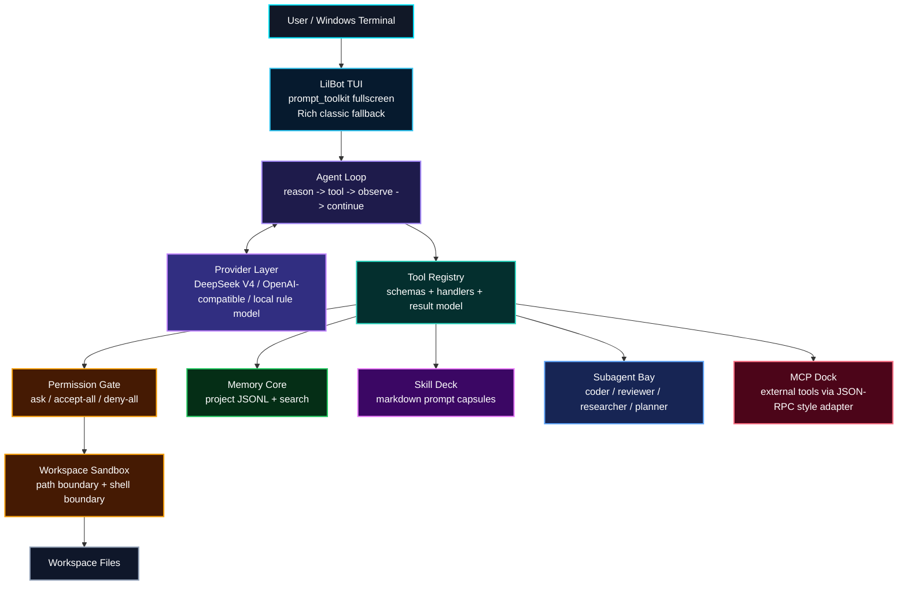
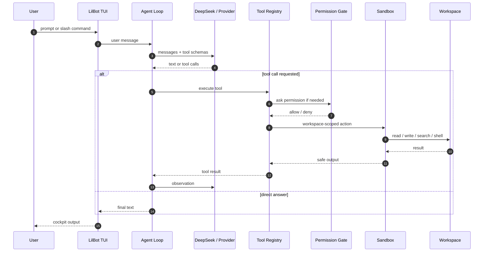
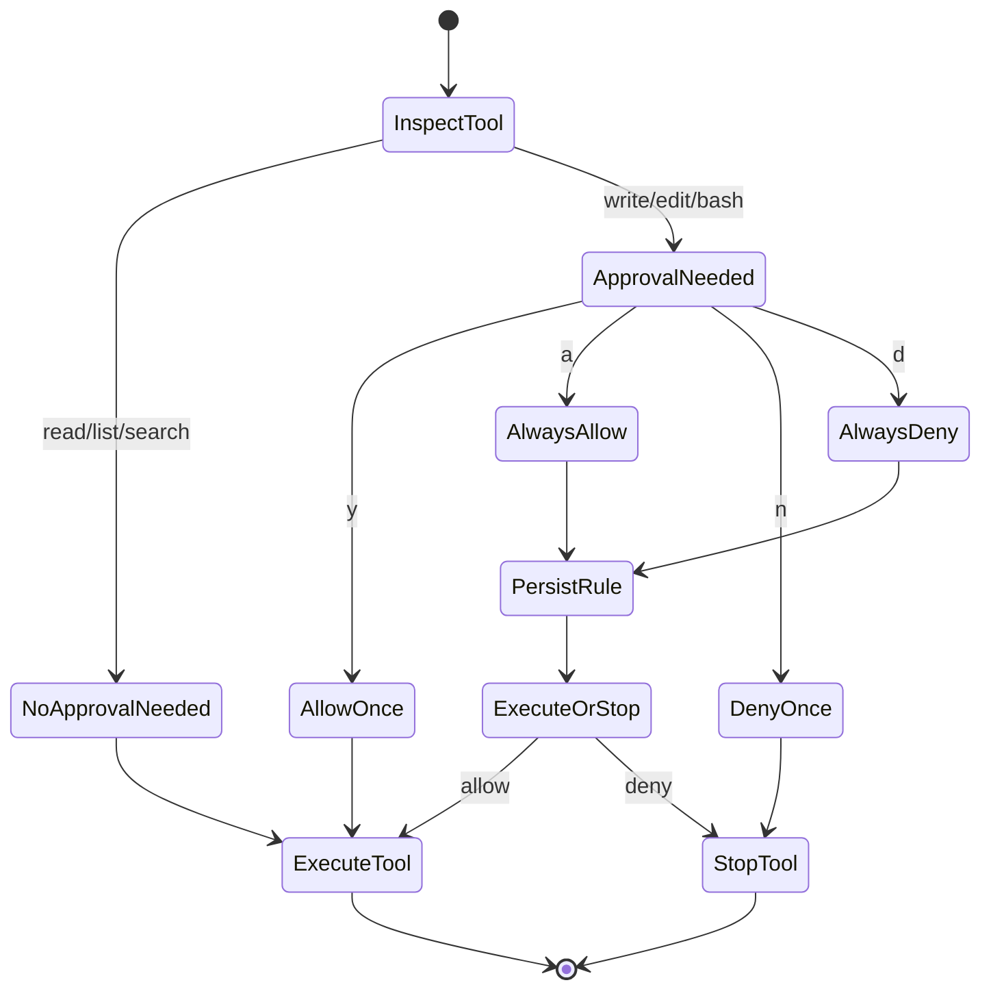
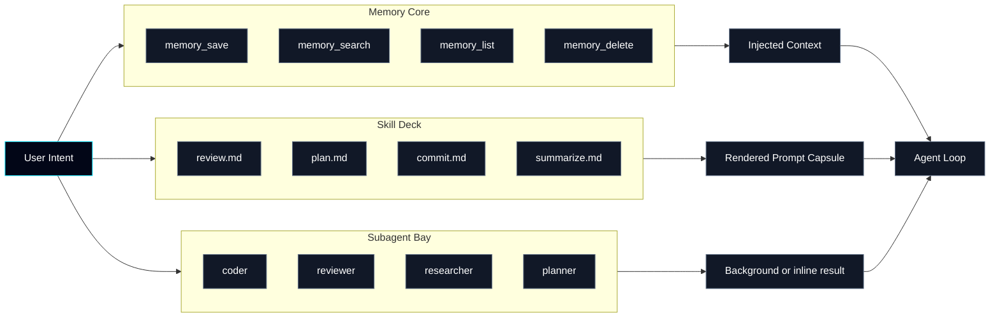
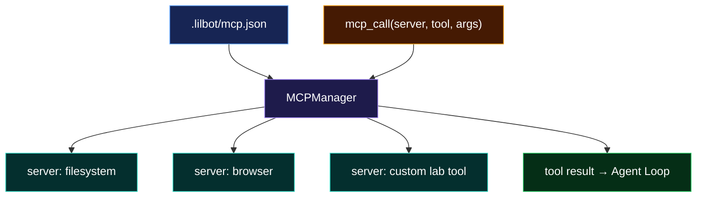
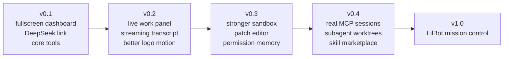

<div align="center">

# LILBOT AGENT

### Clean-room Local Coding Agent / Windows-first / DeepSeek-ready


[](#windows-quick-start)
[](#windows-terminal-notes)
[](#deepseek)
[](#flight-deck)

`LilBot` is a futuristic local coding-agent lab: agent loop, tool bus, permission gate, sandbox, memory core, skills, subagents, and MCP-style adapters.

</div>

---

## Current Status

LilBot is now past the empty-shell stage. The project has a working local agent
loop, OpenAI-compatible provider layer, tool registry, workspace sandbox,
permission manager, durable memory, markdown skills, subagents, MCP-style
adapters, a Windows-first TUI, and a growing compatibility surface inspired by
CodeWhale and Claude Code.

The main quality focus has shifted from adding more compatible names to making
core capabilities enforceable and durable:

- Subagent `allowed_tools` are enforced at runtime, including explicit empty
  allowlists and Claude-style tool names such as `Read` and `Grep`.
- Custom subagents now use a five-gate allowed-tool flow: gates 1-3 reject
  unsafe creation, while gates 4-5 deny unsafe runtime tool calls and record
  transcript evidence.
- Forked skills now execute through the subagent runtime instead of only
  rendering prompt text back into the parent conversation.
- Subagent transcripts are persisted under `.lilbot/subagent-transcripts/` and
  exposed through `transcript_handle`.
- `EnterPlanMode` and `ExitPlanMode` persist plan lifecycle and approval state.
- Pending plan approval now blocks write and execution tools through the central
  tool registry until the plan is approved or rejected.
- `EnterWorktree` and `ExitWorktree` probe git worktree support and return an
  honest unsupported result when worktrees cannot be used.
- The current test suite covers these enforcement and lifecycle paths.

Current verified baseline:

```text
python -m pytest
66 passed
```

---

## Whole Architecture

now we only have the CLI version, in the future, I will find some guy to coorperate with me to develop a coller software version like this:


---

## Why `python -m lilbot`

`-m` means **run a Python module as a program**.

When you run:

```powershell
python -m lilbot
```

Python does this:

```text
current conda/python environment
  -> find package named lilbot
  -> execute lilbot/__main__.py
  -> __main__.py calls lilbot.cli:main()
```

Why this is good on Windows:

- It uses the exact `python` from your active conda environment.
- It avoids hardcoding script paths.
- It works before installing a global `lilbot.exe` command.
- It is the standard way to run package-style CLIs during development.

Later we can also expose:

```powershell
lilbot
```

through `pyproject.toml`, but `python -m lilbot` is the cleanest dev command.

---

## Flight Deck

LilBot is aiming for a terminal cockpit, not a boring command prompt.

```text
┌──────────────────────────────────────────────────────────────┐
│ Agent LilBot-agent-code - deepseek-v4-flash     ready  v0.1  │
├─────────────────────────────┬────────────────────────────────┤
│                             │                                │
│       L I L B O T           │      Work / Tool Stream         │
│   local coding agent        │      permissions / memory       │
│                             │      subagents / mcp            │
├─────────────────────────────┴────────────────────────────────┤
│ Composer: write a task, use /, or run ! command safely        │
└──────────────────────────────────────────────────────────────┘
```

Current default renderer: `prompt_toolkit` full-screen dashboard.

Classic fallback renderer: `Rich`, available with `--classic`.

Python can absolutely build a CLI/TUI as polished as TypeScript tools. Terminals receive ANSI escape sequences, keyboard events, mouse events, and layout redraws. Python libraries like `prompt_toolkit`, `Rich`, and `Textual` can drive those just as well as Node libraries.

---

## System Map



---

## Implementation Map

| Layer | Main Files | Current State |
|---|---|---|
| CLI and runtime wiring | `lilbot/cli.py`, `lilbot/__main__.py` | Builds config, provider, registry, sandbox, memory, skills, subagents, MCP, and TUI. |
| Agent loop | `lilbot/core/agent.py`, `lilbot/core/events.py`, `lilbot/core/prompts.py` | Runs provider turns, executes tools, tracks usage, compacts history, and auto-delegates broad tasks to explorer/research/planner subagents. |
| Provider layer | `lilbot/llm/providers.py` | Supports the local rule model and OpenAI-compatible providers such as DeepSeek. |
| Tool bus | `lilbot/tools/registry.py`, `lilbot/tools/builtin.py` | Registers schemas and handlers for workspace, git, shell, memory, skills, subagents, tasks, automation, MCP, web, document/media probes, compatibility aliases, and central plan-approval gating. |
| Safety boundary | `lilbot/sandbox/workspace.py`, `lilbot/sandbox/permissions.py` | Enforces workspace path boundaries and ask/accept-all/deny-all permission modes. |
| Memory | `lilbot/memory/store.py` | Persists project memory as JSONL with list/search/delete helpers. |
| Skills | `lilbot/skills/registry.py`, `lilbot/skills/bundled/` | Loads inline and forked markdown skills, Claude-style frontmatter, aliases, companion files, allowed tools, agent hints, and model hints. |
| Subagents | `lilbot/subagents/manager.py` | Provides built-in and custom agents, five-gate custom allowed-tool validation, runtime tool allowlists, structured final reports, cancellation, and transcript handles. |
| MCP adapter | `lilbot/mcp/manager.py` | Reads `.lilbot/mcp.json` and provides phase-1 server/tool/resource integration. |
| TUI | `lilbot/tui/classic.py`, `lilbot/tui/dashboard.py`, `lilbot/tui/windows_console.py` | Provides Rich classic fallback and a prompt_toolkit dashboard for Windows-first operation. |

---

## Capability Progress

| Area | Done | Next Gap |
|---|---|---|
| Workspace tools | File reads, directory listing, search, git status/diff/log/show/blame, bounded handles, diagnostics. | Pure-Python patch fallback, richer `run_tests` classification, better `project_map`. |
| Skill ecosystem | Bundled skills, `SKILL.md` folders, metadata parsing, `load_skill`, inline skills, forked skill execution through subagents. | Source precedence, hooks, path-filtered skills, safer shell expansion. |
| Subagents | Built-in roles, custom agents, five-gate allowed-tool protection, Claude tool-name compatibility, durable transcript handles. | Configurable concurrency caps, persisted task recovery, progress events in the UI. |
| Planning lifecycle | `update_plan`, checklists, goals, `EnterPlanMode`, `ExitPlanMode`, persisted approval state, write/execute gating while approval is pending. | Better approval UX and plan review surfaces in the TUI. |
| Worktree lifecycle | `EnterWorktree` / `ExitWorktree` with explicit unsupported fallback. | Stronger branch naming, cleanup/remove flow, per-subagent worktree isolation. |
| Shell and PowerShell | Permission-gated shell execution and background jobs. | Claude-grade PowerShell parser, destructive command classifier, safer command segments. |
| External integrations | Web search/fetch, GitHub via `gh`, MCP phase-1 adapter, automation records. | Deeper MCP resource discovery, stronger GitHub workflows, real automation scheduler. |
| Analysis/media/docs | RLM Python sessions, pandoc/OCR/image probes. | Artifact handles, richer document/spreadsheet/presentation workflows. |

---

## Agent Loop



---

## Permission Gate



---

## Memory / Skills / Subagents



---

## MCP Dock



---

## Windows Quick Start

Python 3.10 is OK. The project is tested with Python 3.10.20 on Windows.

```powershell
cd F:\Experiment_laborotory\collection-claude-code-source-code-main\LilBot-agent-code
conda activate LilBot
pip install -r requirements.txt
pip check
python -m lilbot
```

Use the legacy printed interface only when debugging:

```powershell
python -m lilbot --classic
```

If box lines or Chinese text look wrong, force UTF-8 for the current PowerShell tab:

```powershell
chcp 65001
$OutputEncoding = [System.Text.UTF8Encoding]::new()
[Console]::InputEncoding = [System.Text.UTF8Encoding]::new()
[Console]::OutputEncoding = [System.Text.UTF8Encoding]::new()
python -m lilbot
```

Recommended terminal:

```text
Windows Terminal + Cascadia Mono / JetBrains Mono
```

---

## DeepSeek

Do not commit API keys. Set the key only in your shell or in Windows user environment variables.

For local development, LilBot also auto-loads `.env` from the project root. The file is ignored by Git.

```powershell
DEEPSEEK_API_KEY=sk-...
LILBOT_PROVIDER=deepseek
LILBOT_MODEL=deepseek-v4-flash
LILBOT_BASE_URL=https://api.deepseek.com
```

```powershell
$env:DEEPSEEK_API_KEY="sk-..."
python -m lilbot --provider deepseek --model deepseek-v4-flash
```

One-shot real API smoke test:

```powershell
$env:DEEPSEEK_API_KEY="sk-..."
python -m lilbot --provider deepseek --model deepseek-v4-flash --print "Reply exactly: LilBot OK"
```

Endpoint:

```text
https://api.deepseek.com
```

---

## Command Deck

| Command | Purpose |
|---|---|
| `/help` | Show commands |
| `/copy` | Copy the Trace panel to clipboard |
| `/theme` | Show theme preview |
| `/tools` | List tools |
| `/skills` | List skills |
| `/skill review <target>` | Run a skill template |
| `/memory list/search/save/delete` | Manage memory |
| `/agents` | List subagent types and tasks |
| `/mcp` | List MCP-style server config |
| `/permissions ask/accept-all/deny-all` | Switch permission mode |
| `/exit` | Quit |

Dashboard interaction notes:

- `Trace` is the main conversation and tool-execution stream.
- Select text in `Trace` to copy, or use `/copy` / `F2`.
- Right-click paste and `Ctrl+V` are supported in the Composer.
- The top bar shows approximate context usage, for example `ctx 03%`.
- During model work, the footer switches to a wave animation.

---

## Next Development Focus

Recommended next batch:

1. PowerShell safety.
   - Add a dedicated PowerShell command analyzer for Windows.
   - Classify destructive commands, command separators, redirection,
     subprocess boundaries, path deletes/moves, and background launches.
   - Return structured safety metadata before permission prompts.

2. Subagent lifecycle hardening.
   - Add configurable concurrency limits.
   - Persist task records strongly enough to recover after restart.
   - Surface transcript/progress events in the dashboard.
   - Prepare per-subagent worktree isolation.

3. Worktree isolation.
   - Extend `EnterWorktree` / `ExitWorktree` into a subagent-aware workflow.
   - Add cleanup/remove behavior with explicit permissions.
   - Keep unsupported states honest on systems without git worktree support.

4. LSP phase 1.
   - Add an `LSP` tool that can report symbols/definitions when a local
     language server is available.
   - Fall back cleanly to grep/project-map evidence when LSP is unavailable.

5. Batch 1 cleanup.
   - Add pure-Python `apply_patch` fallback for non-git workspaces.
   - Store test logs/artifact handles.
   - Improve `project_map` from file listing into framework-aware summaries.

---

## Roadmap



---

## Repository Upload

Remote:

```powershell
git remote -v
```

Push:

```powershell
git push -u origin main
```

If GitHub asks for login, use Git Credential Manager or GitHub CLI:

```powershell
gh auth login
gh auth setup-git
git push -u origin main
```
