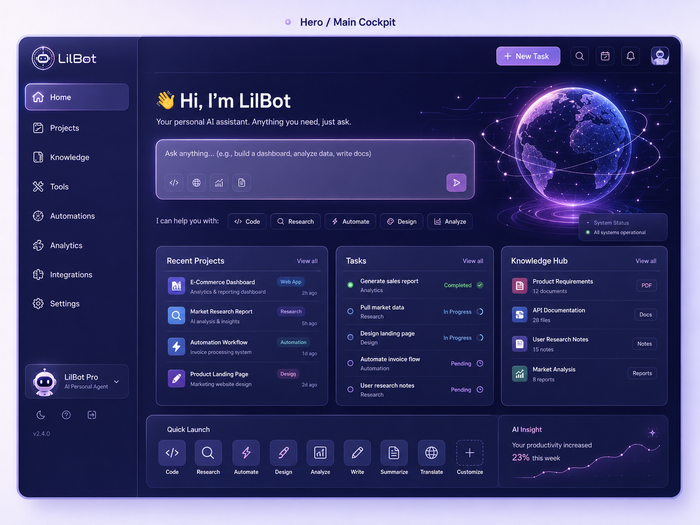
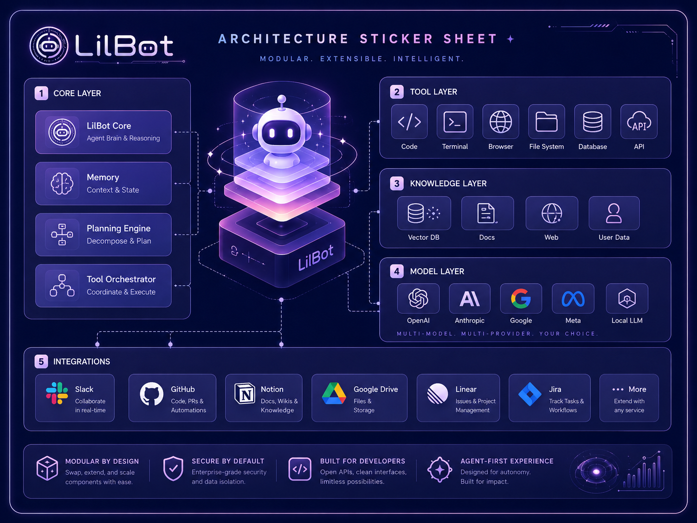
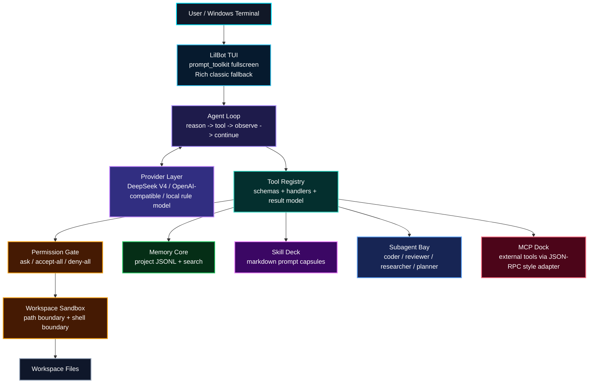
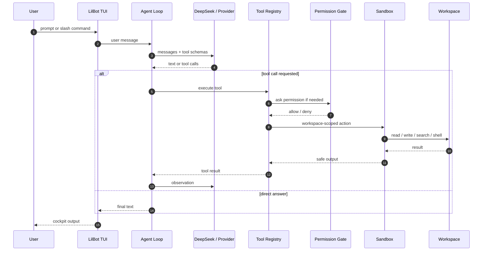
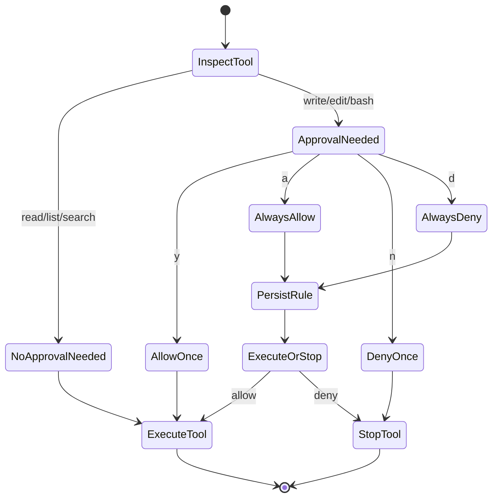
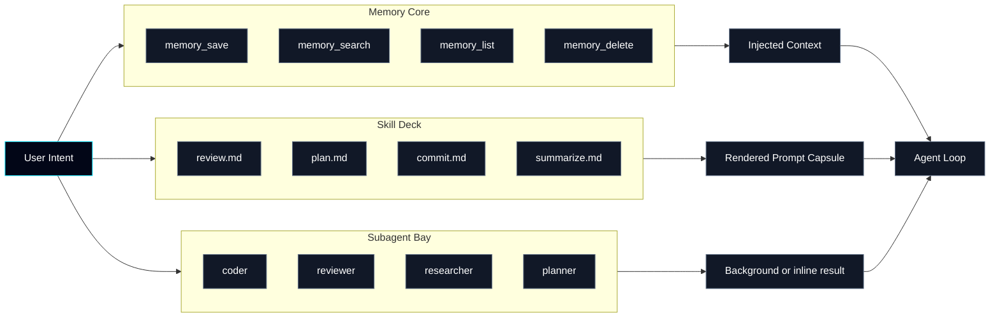
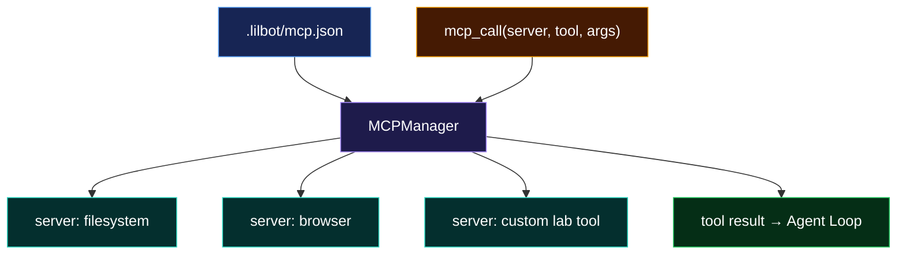
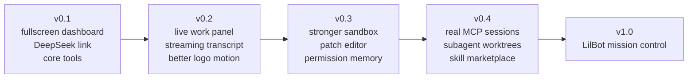

<div align="center">

# LILBOT AGENT

### Clean-room Local Coding Agent / Windows-first / DeepSeek-ready


[](#windows-quick-start)
[](#windows-terminal-notes)
[](#deepseek)
[](#flight-deck)

`LilBot` is a futuristic local coding-agent lab: agent loop, tool bus, permission gate, sandbox, memory core, skills, subagents, and MCP-style adapters.

</div>

---

## Current Status

LilBot is now past the empty-shell stage. The project has a working local agent
loop, OpenAI-compatible provider layer, tool registry, workspace sandbox,
permission manager, durable memory, markdown skills, subagents, MCP-style
adapters, a Windows-first TUI, and a growing compatibility surface inspired by
CodeWhale and Claude Code.

The main quality focus has shifted from adding more compatible names to making
core capabilities enforceable and durable:

- Subagent `allowed_tools` are enforced at runtime, including explicit empty
  allowlists and Claude-style tool names such as `Read` and `Grep`.
- Custom subagents now use a five-gate allowed-tool flow: gates 1-3 reject
  unsafe creation, while gates 4-5 deny unsafe runtime tool calls and record
  transcript evidence.
- Forked skills now execute through the subagent runtime instead of only
  rendering prompt text back into the parent conversation.
- Subagent transcripts are persisted under `.lilbot/subagent-transcripts/` and
  exposed through `transcript_handle`.
- Subagent lifecycle now has a configurable concurrency cap, persisted task
  restart resume, transcript-cursor reads, structured dashboard progress, and
  optional subagent-level `worktree` isolation.
- `agent_open`, `Agent`, and `Task` now expose CodeWhale-style dynamic tool
  descriptions: active built-in/custom agents, when-to-use guidance, full tool
  allowlists, active subagent status, and continue-existing-agent guidance are
  rendered into the tool schemas seen by the parent model.
- The deterministic delegation planner remains as a tested probe/reference for
  question bursts, code exploration, research, mixed public facts, and writing
  fallback, while the main loop now relies on the parent model reading the
  dynamic Agent tool prompt to choose subagents during normal tool-calling.
- Delegation routing now has a regression matrix and a local probe script for
  simple prompts, no-question-mark Chinese question bursts, code exploration,
  research, mixed public facts, and semantic-planner writing fallback.
- `EnterPlanMode` and `ExitPlanMode` persist plan lifecycle and approval state.
- Pending plan approval now blocks write and execution tools through the central
  tool registry until the plan is approved or rejected.
- Windows shell execution now runs through a PowerShell safety analyzer that
  classifies separators, redirection, subprocess boundaries, background
  launches, destructive commands, and unsafe delete/move targets before
  permission prompts.
- `EnterWorktree` and `ExitWorktree` probe git worktree support, return an
  honest unsupported result, and support cleanup/remove for created worktrees.
- Worktree isolation now has branch naming and `WorktreeMergeBack` dry-run or
  merge execution for bringing a worktree branch back into the target branch.
- LSP phase 2 is available through symbols, definitions, workspace symbols,
  references, diagnostics, and rename preview tools. LilBot uses a local
  language server when one is installed, otherwise it falls back to Python AST,
  regex symbols, grep evidence, and project-map context.
- Batch 1 workspace cleanup is implemented: `apply_patch` has a pure-Python
  fallback, `run_tests` writes log artifacts under `.lilbot/test-artifacts/`,
  and `project_map` now detects frameworks, entrypoints, package managers, and
  key source files.
- The dashboard Trace panel starts with a `WELCOME` banner, the left Agent info
  card shows a wider grouped tool/skill inventory, the Work panel shows runtime,
  active tool, subagent, transcript, and worktree status, and Windows `/copy` /
  `F2` uses the native Unicode clipboard format for Chinese text instead of
  `clip.exe`.
- The current test suite covers these enforcement and lifecycle paths.

Current verified baseline:

```text
python -m pytest
103 passed, 6 skipped, 9 subtests passed
```

---

## Whole Architecture

now we only have the CLI version, in the future, I will find some guy to coorperate with me to develop a coller software version like this:





---

## Why `python -m lilbot`

`-m` means **run a Python module as a program**.

When you run:

```powershell
python -m lilbot
```

Python does this:

```text
current conda/python environment
  -> find package named lilbot
  -> execute lilbot/__main__.py
  -> __main__.py calls lilbot.cli:main()
```

Why this is good on Windows:

- It uses the exact `python` from your active conda environment.
- It avoids hardcoding script paths.
- It works before installing a global `lilbot.exe` command.
- It is the standard way to run package-style CLIs during development.

Later we can also expose:

```powershell
lilbot
```

through `pyproject.toml`, but `python -m lilbot` is the cleanest dev command.

---

## Flight Deck

LilBot is aiming for a terminal cockpit, not a boring command prompt.

```text
┌──────────────────────────────────────────────────────────────┐
│ Agent LilBot-agent-code - deepseek-v4-flash     ready  v0.1  │
├─────────────────────────────┬────────────────────────────────┤
│                             │                                │
│       L I L B O T           │      Work / Tool Stream         │
│   local coding agent        │      permissions / memory       │
│                             │      subagents / mcp            │
├─────────────────────────────┴────────────────────────────────┤
│ Composer: write a task, use /, or run ! command safely        │
└──────────────────────────────────────────────────────────────┘
```

Current default renderer: `prompt_toolkit` full-screen dashboard.

Classic fallback renderer: `Rich`, available with `--classic`.

Python can absolutely build a CLI/TUI as polished as TypeScript tools. Terminals receive ANSI escape sequences, keyboard events, mouse events, and layout redraws. Python libraries like `prompt_toolkit`, `Rich`, and `Textual` can drive those just as well as Node libraries.

---

## System Map



---

## Implementation Map

| Layer | Main Files | Current State |
|---|---|---|
| CLI and runtime wiring | `lilbot/cli.py`, `lilbot/__main__.py` | Builds config, provider, registry, sandbox, memory, skills, subagents, MCP, and TUI. |
| Agent loop | `lilbot/core/agent.py`, `lilbot/core/delegation.py`, `lilbot/core/events.py`, `lilbot/core/prompts.py` | Runs provider turns, executes tools, tracks usage, compacts history, and exposes live CodeWhale-style Agent tool schemas so the parent model can choose subagents during normal tool-calling. |
| Provider layer | `lilbot/llm/providers.py` | Supports the local rule model and OpenAI-compatible providers such as DeepSeek. |
| Tool bus | `lilbot/tools/registry.py`, `lilbot/tools/builtin.py` | Registers schemas and handlers for workspace, git, shell, memory, skills, subagents, tasks, automation, MCP, web, LSP/navigation, worktree merge-back, document/media probes, compatibility aliases, and central plan-approval gating. |
| Safety boundary | `lilbot/sandbox/workspace.py`, `lilbot/sandbox/permissions.py` | Enforces workspace path boundaries and ask/accept-all/deny-all permission modes. |
| Memory | `lilbot/memory/store.py` | Persists project memory as JSONL with list/search/delete helpers. |
| Skills | `lilbot/skills/registry.py`, `lilbot/skills/bundled/` | Loads inline and forked markdown skills, Claude-style frontmatter, aliases, companion files, allowed tools, agent hints, and model hints. |
| Subagents | `lilbot/subagents/manager.py`, `lilbot/subagents/render.py` | Provides built-in and custom agents, dynamic Agent tool descriptions, five-gate custom allowed-tool validation, runtime tool allowlists, concurrency limits, restart resume, structured final reports, cancellation, progress events, transcript handles, and optional worktree isolation. |
| MCP adapter | `lilbot/mcp/manager.py` | Reads `.lilbot/mcp.json` and provides phase-1 server/tool/resource integration. |
| TUI | `lilbot/tui/classic.py`, `lilbot/tui/dashboard.py`, `lilbot/tui/windows_console.py` | Provides Rich classic fallback and a prompt_toolkit dashboard with Trace, expanded Agent inventory, structured Work status, permission popups, and transcript/progress visibility. |

---

## Capability Progress

| Area | Done | Next Gap |
|---|---|---|
| Workspace tools | File reads, directory listing, search, git status/diff/log/show/blame, bounded handles, diagnostics, pure-Python patch fallback, test log artifacts, and framework-aware `project_map`. | Richer test classification and artifact retrieval UX. |
| Code navigation | `lsp_symbols`, `lsp_definition`, `lsp_workspace_symbols`, `lsp_references`, `lsp_diagnostics`, and `lsp_rename_preview`, with local LSP when available and AST/regex/grep fallback when unavailable. | Persistent warm LSP server sessions, references quality for dynamic languages, and safe rename apply. |
| Skill ecosystem | Bundled skills, `SKILL.md` folders, metadata parsing, `load_skill`, inline skills, forked skill execution through subagents. | Source precedence, hooks, path-filtered skills, safer shell expansion. |
| Subagents | Built-in roles, custom agents, five-gate allowed-tool protection, Claude tool-name compatibility, dynamic `Agent` tool prompt parity, delegation matrix probes, concurrency cap, restart resume, progress events, structured dashboard status, durable transcript handles, optional worktree isolation. | Exact model-state resume, per-agent resource quotas, richer cancellation semantics. |
| Planning lifecycle | `update_plan`, checklists, goals, `EnterPlanMode`, `ExitPlanMode`, persisted approval state, write/execute gating while approval is pending. | Better approval UX and plan review surfaces in the TUI. |
| Worktree lifecycle | `EnterWorktree` / `ExitWorktree` with explicit unsupported fallback and cleanup/remove; subagents can request managed `worktree` isolation; `WorktreeMergeBack` can preflight or merge a source branch back. | Conflict UI, merge-back artifact summaries, stronger cleanup diagnostics. |
| Shell and PowerShell | Permission-gated shell execution, background jobs, PowerShell safety metadata, destructive command classification, and hard blocks for unsafe delete/move targets. | Expand analyzer coverage for advanced PowerShell AST cases and richer remediation hints. |
| External integrations | Web search/fetch, GitHub via `gh`, MCP phase-1 adapter, automation records. | Deeper MCP resource discovery, stronger GitHub workflows, real automation scheduler. |
| Analysis/media/docs | RLM Python sessions, pandoc/OCR/image probes. | Artifact handles, richer document/spreadsheet/presentation workflows. |

---

## Agent Loop



---

## Permission Gate



---

## Memory / Skills / Subagents



---

## MCP Dock



---

## Windows Quick Start

Python 3.10 is OK. The project is tested with Python 3.10.20 on Windows.

```powershell
cd F:\Experiment_laborotory\collection-claude-code-source-code-main\LilBot-agent-code
conda activate LilBot
pip install -r requirements.txt
pip check
python -m lilbot
```

Use the legacy printed interface only when debugging:

```powershell
python -m lilbot --classic
```

If box lines or Chinese text look wrong, force UTF-8 for the current PowerShell tab:

```powershell
chcp 65001
$OutputEncoding = [System.Text.UTF8Encoding]::new()
[Console]::InputEncoding = [System.Text.UTF8Encoding]::new()
[Console]::OutputEncoding = [System.Text.UTF8Encoding]::new()
python -m lilbot
```

Recommended terminal:

```text
Windows Terminal + Cascadia Mono / JetBrains Mono
```

---

## DeepSeek

Do not commit API keys. Set the key only in your shell or in Windows user environment variables.

For local development, LilBot also auto-loads `.env` from the project root. The file is ignored by Git.

```powershell
DEEPSEEK_API_KEY=sk-...
LILBOT_PROVIDER=deepseek
LILBOT_MODEL=deepseek-v4-flash
LILBOT_BASE_URL=https://api.deepseek.com
```

```powershell
$env:DEEPSEEK_API_KEY="sk-..."
python -m lilbot --provider deepseek --model deepseek-v4-flash
```

One-shot real API smoke test:

```powershell
$env:DEEPSEEK_API_KEY="sk-..."
python -m lilbot --provider deepseek --model deepseek-v4-flash --print "Reply exactly: LilBot OK"
```

Endpoint:

```text
https://api.deepseek.com
```

---

## Command Deck

| Command | Purpose |
|---|---|
| `/help` | Show commands |
| `/copy` | Copy the Trace panel to clipboard |
| `/theme` | Show theme preview |
| `/tools` | List tools |
| `/skills` | List skills |
| `/skill review <target>` | Run a skill template |
| `/memory list/search/save/delete` | Manage memory |
| `/agents` | List subagent types and tasks |
| `/mcp` | List MCP-style server config |
| `/permissions ask/accept-all/deny-all` | Switch permission mode |
| `/exit` | Quit |

Dashboard interaction notes:

- `Trace` is the main conversation and tool-execution stream.
- Select text in `Trace` to copy, or use `/copy` / `F2`. On Windows this writes
  `CF_UNICODETEXT`, so Chinese Trace content should paste without mojibake.
- Right-click paste and `Ctrl+V` are supported in the Composer.
- The top bar shows approximate context usage, for example `ctx 03%`.
- During model work, the footer switches to a wave animation.
- The `Work` panel shows runtime status, active tool state, recent subagents,
  last progress event, transcript handles, worktree branch, and worktree state.

### Manual Subagent Concurrency Test

Use this quick local probe to verify queueing without calling a real model:

```powershell
$env:LILBOT_SUBAGENT_MAX_CONCURRENT='3'
@'
from pathlib import Path
import threading, time
from lilbot.core.events import ProviderTurn
from lilbot.subagents import SubAgentManager

release = threading.Event()
def provider(messages, tools):
    release.wait(20)
    return ProviderTurn(content="done")

manager = SubAgentManager(provider, Path(".lilbot/agents"), max_concurrent=3)
tasks = [manager.open("writer", f"manual concurrency {i}", background=True) for i in range(6)]
time.sleep(0.3)
print(manager.runtime_status())
release.set()
for task in tasks:
    while not task.terminal:
        time.sleep(0.05)
print(manager.runtime_status())
'@ | python -
```

Expected first print: `running` is `3`, `queued` is `3`. Expected second print:
all six tasks are terminal.

### Manual Delegation Matrix Probe

Use this local probe to inspect routing without calling a model or the network:

```powershell
python experiment\delegation_matrix.py
python experiment\delegation_matrix.py "谁是2025年NBA冠军 那谁是那一年的FMVP呢 哦对还有NBA是哪一个国家的比赛呀"
```

Expected shape for the second command: a deterministic plan with three
`researcher` probes named `auto_question_01`, `auto_question_02`, and
`auto_question_03`. A prompt such as `请创作一篇古风的1000字散文...` should show
`deterministic_plan: null` plus `semantic_planner_if_no_plan: true`, meaning the
host did not hard-code that genre but the model-side delegation planner should
be consulted.

---

## Lifecycle Theory

LilBot treats long-running agent work as a small lifecycle system rather than a
single function call. A subagent task moves through `queued`, `running`, and a
terminal state such as `completed`, `failed`, or `cancelled`. Every meaningful
transition is also appended to a JSONL transcript. This makes the dashboard and
tools read the same source of truth:

```text
SubAgentTask state
  -> persisted in .lilbot/subagent-tasks.json
  -> mirrored by transcript events in .lilbot/subagent-transcripts/*.jsonl
  -> projected into Work panel progress rows
```

Restart resume is deliberately conservative. If LilBot restarts while a task is
non-terminal, the task is recovered as `queued`, marked with `recovered=True`,
and scheduled again after the runtime is configured. This resumes from the
assignment prompt and transcript evidence, not from hidden model token state.
That keeps the behavior honest while still avoiding the old failure-only
recovery path.

Transcript cursors are line-based. `agent_transcript` returns events after a
cursor and a new cursor, so a dashboard or future GUI can poll progress without
re-reading the whole transcript.

Question-burst delegation is a separate planner rule. When one user message
contains three or more unrelated questions, LilBot opens focused `researcher`
subagents up to `LILBOT_SUBAGENT_MAX_CONCURRENT` and the current step budget.
If there are more questions than available subagent slots, LilBot groups the
extra questions into compact ordered question groups instead of dropping them.
Normal broad code/research/planning tasks keep a more conservative budget so
they still leave room for parent synthesis.

### Delegation Theory

CodeWhale/Claude-style delegation does not try to hard-code every possible
task category in the host runtime. The product pattern is:

```text
agent descriptions + tool prompt
  -> model decides whether Agent is useful
  -> runtime validates allowed/disallowed tools, recursion, permissions,
     lifecycle, transcripts, and isolation
```

Clean-room notes from the local CodeWhale/Claude Code source audit:

- `AgentTool/prompt.ts` dynamically renders available agent types, their
  `whenToUse` descriptions, and tool limits into the tool prompt, so the parent
  model can decide when to spawn one or several agents.
- `loadAgentsDir.ts` loads project/user custom agents from agent files with
  descriptions, prompts, tool allow/disallow lists, models, and permission mode.
- `agentToolUtils.ts` and tool constants hard-code safety boundaries: recursive
  agent tools are disallowed, async/background tools are constrained, and custom
  agent tool lists are resolved before runtime execution.
- `forkSubagent.ts` is a lifecycle/runtime path, not a keyword classifier: it
  inherits context through a directive and still prevents recursive forking.

LilBot now follows that split more closely. `ToolRegistry.schemas()` asks the
subagent manager for live render context, then `lilbot/subagents/render.py`
injects CodeWhale-style lines into `agent_open`, `Agent`, and `Task`:

```text
- researcher: Use for web research ... (Tools: web_search, fetch_url, ...)
- explore: Use for codebase mapping ... (Tools: project_map, read_file, ...)
```

The parent model sees these descriptions during normal tool-calling, including
active subagent status and guidance to continue an existing agent before
launching a duplicate. The runtime remains the source of truth: unknown agent
types, recursive subagent tools, write/execute tools, plan-control tools,
custom allowlists, transcripts, worktree isolation, and lifecycle state are
still enforced by the subagent manager and registry gates.

`delegation.py` remains useful as a deterministic probe and planning reference.
It is covered by a regression matrix for question bursts, no-question-mark
Chinese clauses, code exploration, mixed public facts, and writing fallback.
That lets us test routing theory without forcing the host runtime to hard-code
every future genre or task category.

---

## LSP Theory

LilBot's code navigation tools follow a "semantic first, evidence fallback"
rule:

```text
local language server available
  -> use LSP request
  -> normalize result into path/line/character records
otherwise
  -> Python AST for Python symbols and syntax diagnostics
  -> regex symbol extraction for common languages
  -> grep-style reference evidence
```

The current LSP surface includes:

| Tool | Purpose | Fallback |
|---|---|---|
| `lsp_symbols` | Document/project symbols | AST/regex scan |
| `lsp_definition` | Symbol definition | AST/regex definitions, then grep evidence |
| `lsp_workspace_symbols` | Workspace symbol search | AST/regex project scan |
| `lsp_references` | Reference lookup | grep-style references |
| `lsp_diagnostics` | Diagnostics | Python syntax diagnostics |
| `lsp_rename_preview` | Rename edit preview | reference candidates only |

Rename preview does not write files. It returns candidate edits so a later
phase can add permission-gated apply semantics with conflict checks.

---

## Worktree Theory

Worktree isolation gives a subagent a separate checkout under
`.lilbot/worktrees/` so it can inspect or modify files without sharing the main
workspace directory. Branch naming matters because merge-back needs a durable
source branch, not just a detached checkout.

The current flow is:

```text
EnterWorktree or subagent isolation=worktree
  -> probe git worktree support
  -> create a named branch/worktree when supported
  -> run work in the worktree sandbox
  -> optionally cleanup/remove the worktree
  -> WorktreeMergeBack dry-run shows source -> target diff
  -> WorktreeMergeBack dry_run=false merges after permission and clean-tree checks
```

Unsupported systems return structured `unsupported` results rather than
pretending worktree isolation happened.

---

## Update Log

### 2026-06-16

- Added subagent restart resume: persisted non-terminal tasks recover as
  `queued` and are automatically scheduled after tool/context configuration.
- Added transcript cursor reads through `agent_transcript` and progress metadata
  in subagent projections.
- Added worktree branch naming for managed subagent worktrees and `EnterWorktree`
  branch/ref options.
- Added `WorktreeMergeBack` / `worktree_merge_back` for merge-back preflight and
  permission-gated execution.
- Added LSP phase 2 tools: `lsp_workspace_symbols`, `lsp_references`,
  `lsp_diagnostics`, and `lsp_rename_preview`.
- Updated the Work panel to show subagent last event, event count, resume count,
  transcript handle, worktree branch, and worktree path.
- Added CodeWhale-style dynamic Agent tool prompt parity: `agent_open`,
  `Agent`, and `Task` now render live agent types, when-to-use guidance, full
  tool allowlists, active subagent status, and continue-existing-agent guidance
  into the tool schemas seen by the parent model.
- Kept deterministic delegation routing as a testable probe/reference instead
  of host-runtime keyword control: the matrix covers no-question-mark Chinese
  question bursts, code exploration, research, mixed fact scopes, and semantic
  writing fallback.
- Expanded the left Agent dashboard card so the information page shows more of
  the tool and skill inventory instead of leaving a large blank area.
- Re-audited the local CodeWhale/Claude Code `AgentTool` source and documented
  the split between dynamic model-side agent selection and host-side safety,
  permission, lifecycle, transcript, and isolation enforcement.
- Added `tests/test_delegation_matrix.py` plus
  `experiment/delegation_matrix.py` to probe the full delegation route for
  simple prompts, no-question-mark Chinese question bursts, code exploration,
  research, mixed fact scopes, and semantic-planner writing fallback.
- Fixed Windows `/copy` / `F2` Chinese clipboard mojibake by writing native
  `CF_UNICODETEXT` instead of piping text through `clip.exe`.

### 2026-06-15

- Enforced plan approval for write/execute tools.
- Added PowerShell safety analysis before shell permission prompts.
- Added custom subagent five-gate allowed-tool protection.
- Added forked skill execution through subagents.
- Added durable subagent transcripts, concurrency limits, restart recovery,
  optional worktree isolation, and structured dashboard subagent status.
- Added LSP phase 1 symbols/definition tools and Batch 1 workspace cleanup:
  pure-Python patch fallback, test log artifacts, and framework-aware
  `project_map`.

---

## Next Development Focus

Recommended next batch:

1. Agent listing attachment and continuation UX.
   - Mirror CodeWhale's optional agent-list attachment path so changing custom
     agents does not always mutate the tool schema.
   - Add a stronger "continue existing agent" workflow around `agent_eval`
     follow-up messages and dashboard transcript handles.
   - Add tests that assert the parent can reuse an existing matching subagent
     instead of opening a duplicate.

2. Persistent LSP sessions.
   - Keep language servers warm across calls instead of one short request per
     lookup.
   - Add server lifecycle controls, cache invalidation, and richer diagnostics
     collection.

3. Worktree merge UX.
   - Add merge-back artifact summaries.
   - Add conflict reporting and cleanup diagnostics.
   - Add safer branch naming policy for repeated task names.

4. Product-level hooks and lifecycle.
   - Add pre-tool/post-tool hooks.
   - Surface plan approval and PowerShell risk in the dashboard more clearly.
   - Add richer task/test artifact retrieval from handles.

5. Subagent resource controls.
   - Add per-agent time/tool/output quotas.
   - Add clearer cancellation semantics for queued vs running tasks.
   - Explore exact resume from structured conversation checkpoints.

---

## Roadmap



---

## Repository Upload

Remote:

```powershell
git remote -v
```

Push:

```powershell
git push -u origin main
```

If GitHub asks for login, use Git Credential Manager or GitHub CLI:

```powershell
gh auth login
gh auth setup-git
git push -u origin main
```
