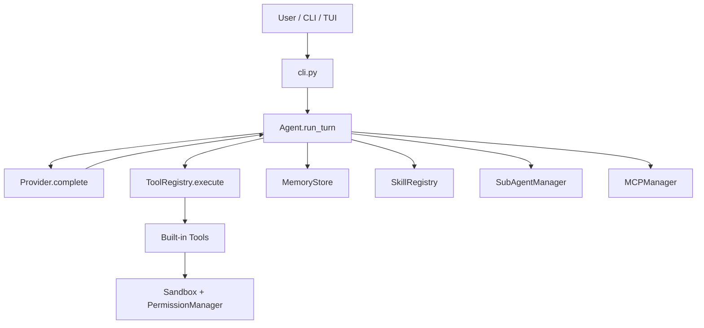

# LilBot-agent 技术栈与工程设计面试问答

这份文档只针对 `LilBot-agent-code`，目标是帮你把我们的智能体项目讲成一套清晰、有工程深度、经得起追问的面试回答。

## 0. 一句话定位

### Q1：LilBot-agent 是什么？

答：LilBot-agent 是一个 clean-room 的本地 AI Coding Agent。它把 LLM、工具调用、权限沙箱、项目记忆、技能模板、子代理、MCP-style 扩展和终端 UI 组合成一个可控的本地智能体运行时。核心价值不是单纯调模型 API，而是让模型能在受控边界内理解项目、调用工具、修改代码、运行命令，并把过程以事件流形式反馈给用户。

### Q2：如果用一句大厂风格的话介绍它？

答：LilBot-agent 是一个面向本地研发工作流的 Agent Runtime，采用 Provider 抽象屏蔽模型差异，用 ToolRegistry 暴露可审计工具能力，通过 workspace sandbox 和 PermissionManager 控制副作用，并用 skills、memory、subagents、MCP-style adapter 扩展复杂任务编排能力。

### Q3：两分钟项目介绍怎么说？

答：LilBot-agent 是我们实现的本地智能体项目，核心是把大模型从“问答接口”升级成“受控执行系统”。入口在 `lilbot/cli.py`，启动时会组装配置、Provider、工具注册表、工作区沙箱、权限管理、记忆、技能、子代理和 MCP 管理器。主循环在 `lilbot/core/agent.py`，用户输入进入 `Agent.run_turn()` 后，系统先把 memory 和 skills 注入 system prompt，再调用 Provider 获取 `ProviderTurn`。如果模型返回 tool calls，Agent 会逐个发出 `ToolStarted`、执行工具、发出 `ToolFinished`，再把工具结果写回消息历史，让模型继续推理，直到没有工具调用或达到 `max_steps`。

工程上我们做了几层关键保护：所有文件路径都必须通过 `Sandbox.resolve()` 限制在 workspace 内；写文件、shell、patch、GitHub 写操作等高风险动作走 `PermissionManager`；工具执行统一从 `ToolRegistry` 分发，并记录耗时、错误和输出截断；网络工具会限制 URL scheme 和内网地址，防 SSRF；上下文过长时做 compact；子代理有角色定义、任务状态和结构化输出契约。整体来说，它是一个轻量但完整的 AI Coding Agent Harness。

## 1. 架构总览

### Q4：LilBot-agent 的核心架构怎么分层？

答：我会分成七层：

1. CLI/TUI 层：`lilbot/cli.py`、`lilbot/tui/*`，负责参数解析、slash commands、事件渲染。
2. Agent Loop 层：`lilbot/core/agent.py`，负责多轮推理、工具调用闭环、step budget、context compact。
3. Provider 层：`lilbot/llm/providers.py`，支持离线规则 Provider 和 OpenAI-compatible Provider。
4. Tool 层：`lilbot/tools/registry.py`、`lilbot/tools/builtin.py`，负责 schema 暴露、工具执行、耗时和截断。
5. Safety 层：`lilbot/sandbox/*`，负责 workspace 边界、shell 执行边界和权限决策。
6. State 层：`.lilbot/` 下保存 config、memory、permissions、skills、agents、MCP 配置等状态。
7. Orchestration 层：skills、subagents、MCP-style server，把单轮工具执行扩展为可复用工作流。

### Q5：启动时 runtime 是怎么组装的？

答：`build_runtime()` 是典型的依赖装配函数。它先创建 `.lilbot` 状态目录，然后依次创建 `Sandbox`、`PermissionManager`、`MemoryStore`、`SkillRegistry`、Provider、`SubAgentManager`、`MCPManager`、`ToolRegistry`，最后用这些对象构造 `ToolContext` 和 `Agent`。这种设计把基础设施从 Agent Loop 里抽出去，Agent 只消费抽象对象，便于测试和替换。

### Q6：为什么说 LilBot 是 Agent Harness，而不是普通 ChatBot？

答：ChatBot 的核心是输入文本、输出文本；Agent Harness 的核心是“模型 + 工具 + 状态 + 安全边界 + 运行时事件”。LilBot 里模型可以通过工具读写 workspace、跑测试、搜索 web、管理 memory、调用 skill、启动 subagent，还能通过权限和沙箱控制副作用。这已经是一个小型操作系统式的智能体运行时。

## 2. 技术栈

### Q7：LilBot-agent 的技术栈是什么？

答：

| 模块 | 技术 |
| --- | --- |
| 语言 | Python >= 3.10 |
| 包管理 | `pyproject.toml` + setuptools |
| HTTP/模型调用 | `httpx` |
| 交互式输入 | `prompt_toolkit` |
| 终端渲染 | `rich` + prompt_toolkit dashboard |
| 配置状态 | `.lilbot/config.json`、环境变量、JSONL |
| 工具协议 | JSON Schema 风格 tool schema |
| Provider 协议 | OpenAI-compatible Chat Completions |
| 测试 | Python `unittest` |

### Q8：为什么选 Python？

答：Python 对本地自动化、文件处理、命令执行和快速原型非常友好。LilBot 的目标是做 clean-room local coding agent，Python 可以让 Agent Loop、工具注册、沙箱和 TUI 都保持较低理解成本。后续如果要生产化，可以把高风险执行层或长任务调度迁到更强隔离的进程/容器里。

### Q9：项目的依赖为什么很少？

答：核心依赖只有 `httpx`、`prompt_toolkit`、`rich`，说明架构倾向于轻量可控。模型调用不绑定某个厂商 SDK，而是通过 OpenAI-compatible HTTP 接口；UI 用成熟库；其他能力如 memory、skills、sandbox、tool registry 都自己实现。这种取舍适合学习、可控和快速迭代。

## 3. Agent Loop

### Q10：`Agent.run_turn()` 的主流程是什么？

答：

1. 把用户输入追加到 `messages`。
2. 调用 `_maybe_compact()` 控制上下文长度。
3. 调用 `provider.complete(messages, registry.schemas())`。
4. 如果 Provider 返回文本，产出 `TextDelta`。
5. 如果没有 tool calls，记录 assistant message，产出 `TurnFinished`，结束。
6. 如果有 tool calls，按剩余 step budget 截断要执行的工具列表。
7. 对每个工具产出 `ToolStarted`，调用 `registry.execute()`，产出 `ToolFinished`。
8. 把 tool result 写回 `messages`，继续下一轮。
9. 达到 `max_steps` 后，用 `_synthesize_after_step_limit()` 基于已有证据生成最终回答。

### Q11：为什么 Agent Loop 用 Iterator/事件流？

答：因为智能体执行不是一次性返回。用户需要实时看到模型文本、工具开始、工具结果、错误和最终完成事件。LilBot 用 `TextDelta`、`ToolStarted`、`ToolFinished`、`TurnFinished` 这几个事件把执行过程解耦出来，CLI/TUI 只负责消费事件渲染，不关心底层工具怎么执行。

### Q12：`max_steps` 有什么作用？

答：`max_steps` 是防止模型无限调用工具的硬边界。模型可能因为工具结果不确定、prompt 不清晰或 provider 行为异常而循环调用工具。LilBot 限制每 turn 最多执行 `max_steps` 个工具，达到上限后不再继续 tool call，而是要求 Provider 基于现有上下文综合答案。这比直接中断更友好。

### Q13：为什么未执行的 tool calls 不写入历史？

答：如果模型一次返回多个 tool calls，但 step budget 只够执行其中一部分，未执行的工具不应该写入 assistant tool message。否则下一轮上下文会出现“模型声明调用了工具，但没有对应 tool result”的不一致状态。测试里也覆盖了这一点。

## 4. Provider 抽象

### Q14：LilBot 支持哪些 Provider？

答：当前有两个 Provider 形态：

- `RuleBasedProvider`：离线规则 Provider，用于无 API key 的本地演示、测试和调试。
- `OpenAICompatibleProvider`：通过 `/chat/completions` 接口接入 OpenAI-compatible 模型，比如 OpenAI、DeepSeek 或自定义兼容服务。

`choose_provider()` 会根据配置选择具体 Provider。

### Q15：为什么要保留 RuleBasedProvider？

答：它让项目在没有 API key、没有网络或 CI 环境里也能跑通 Agent shell。RuleBasedProvider 会根据用户输入简单规则触发工具，比如 `!` 开头走 shell，包含 read 走 `read_file`，包含 web/latest 走 `web_search`。它不是智能模型，但能验证 runtime、工具注册、TUI、权限和测试链路。

### Q16：OpenAICompatibleProvider 的边界是什么？

答：Provider 只负责把 LilBot 的内部消息和 tool schema 转换成 OpenAI-compatible 请求，并把模型响应转换成 `ProviderTurn(content, tool_calls, usage)`。它不做权限、不执行工具、不管理 memory。这样 Provider 层可以被替换，Agent Loop 不需要改。

### Q17：为什么 tool schema 要在 Provider 请求里传？

答：模型只有看到 tool schema 才知道可用工具、参数结构和调用方式。LilBot 的 `ToolRegistry.schemas()` 输出 `{name, description, input_schema}`，Provider 再转换成 OpenAI function tool 格式。这是模型和本地能力之间的 API 契约。

## 5. ToolRegistry 与工具系统

### Q18：ToolRegistry 的职责是什么？

答：`ToolRegistry` 是工具总线，负责四件事：

1. `register()` 注册工具定义。
2. `schemas()` 把工具暴露给模型。
3. `resolve()` 支持大小写、snake/camel、`_tool` 后缀等兼容解析。
4. `execute()` 统一执行工具、捕获异常、记录耗时、截断超长输出。

### Q19：一个工具定义包含什么？

答：`ToolDef` 包含 `name`、`description`、`input_schema`、`handler`。这是典型的插件化设计：schema 面向模型，handler 面向本地执行，registry 负责把两边接起来。

### Q20：LilBot 的工具能力有哪些类别？

答：

| 能力域 | 代表工具 |
| --- | --- |
| Workspace 文件 | `list_dir`、`read_file`、`write_file`、`edit_file`、`apply_patch` |
| 搜索 | `glob`、`grep`、`file_search`、`grep_files` |
| Shell | `bash`、`exec_shell`、`exec_shell_wait`、`exec_shell_cancel` |
| Git | `git_status`、`git_diff`、`git_log`、`git_show`、`git_blame` |
| Web | `web_search`、`fetch_url`、`web_fetch`、`web_run` |
| Memory | `memory_save`、`memory_list`、`memory_search`、`memory_delete` |
| Skills | `skill_list`、`skill_run`、`Skill`、`load_skill` |
| Subagents | `agent_spawn`、`agent_status`、`agent_list`、`agent_open`、`agent_eval`、`agent_close` |
| MCP | `mcp_servers`、`mcp_call` |
| 项目辅助 | `diagnostics`、`run_tests`、`validate_data`、`project_map` |
| 计划/任务 | `update_plan`、`checklist_write`、todo/task/goal 类工具 |

### Q21：为什么工具输出要截断？

答：工具输出会进入模型上下文。如果 `read_file` 读了大文件、`grep` 命中太多、shell 输出爆量，会导致上下文膨胀甚至请求失败。LilBot 在 `ToolRegistry.execute()` 里统一对超过 12000 字符的输出截断，并打 `metadata["truncated"] = True`，这是保护上下文预算的工程边界。

### Q22：`resolve()` 兼容工具名有什么价值？

答：模型可能输出 `ReadFile`、`read-file`、`read_file_tool` 这类变体。`resolve()` 做大小写、snake/camel、后缀归一，可以提高工具调用鲁棒性，减少因为模型轻微命名偏差导致的失败。

## 6. 权限与沙箱

### Q23：Sandbox 解决什么问题？

答：`Sandbox` 是 workspace-scoped 文件系统和命令执行边界。所有相对路径都会解析到 `workspace` 下；如果路径试图逃逸到外部，比如 `../outside.txt`，`Sandbox.resolve()` 会抛 `SandboxError`。这是防止模型误读/误写用户系统文件的基础保护。

### Q24：Sandbox 的路径校验怎么实现？

答：核心逻辑是把输入路径变成绝对路径并 `resolve()`，然后检查 resolved path 是否等于 workspace root 或在 root 的 parents 内。只要不在 workspace 内，就拒绝。这比简单字符串前缀判断更稳，因为能处理 `..`、符号链接解析后的实际路径等情况。

### Q25：PermissionManager 的职责是什么？

答：`PermissionManager` 负责决定一个带副作用动作是否允许执行。它支持三种模式：

- `ask`：交互式询问用户。
- `accept-all`：全部允许，适合受信任演示或自动化。
- `deny-all`：全部拒绝，适合非交互安全模式。

在 `ask` 模式下，用户可以 allow once、always allow、deny once、always deny；持久规则保存在 `.lilbot/permissions.json`。

### Q26：哪些操作应该走权限？

答：写文件、编辑文件、apply patch、shell、GitHub comment/close、测试命令、后台任务等都应该走权限。只读类工具可以相对宽松，但也要注意敏感文件。LilBot 的设计是把权限逻辑放在工具 handler 内，通过 `ctx.permissions.check(action, description)` 判断。

### Q27：网络工具有什么安全设计？

答：`fetch_url` 不是直接抓任意 URL，而是校验：

- 只允许 `http://` 和 `https://`。
- 拒绝 localhost、127.0.0.1、私有地址、link-local、multicast、reserved 等内网/特殊地址。
- 限制 timeout 和 max chars。
- 清洗 HTML，去 script/style，转成可读文本。

这是在防 SSRF、内网探测和大响应攻击。

## 7. Memory 设计

### Q28：LilBot 的 memory 怎么存？

答：`MemoryStore` 使用 `.lilbot/memory.jsonl` 保存记忆，每行是一个 JSON 对象，包含 `id`、`name`、`text`、`kind`、`scope`、`created_at`。JSONL 的好处是简单、可追加、可读、便于人工修复。

### Q29：memory 怎么进入模型上下文？

答：`build_system_prompt(memory, skills)` 会调用 `memory.context()`，默认取最近若干条 memory，以短摘要形式注入 system prompt。这样模型每轮都能看到稳定偏好和项目背景，但不会把全部 memory 塞进上下文。

### Q30：memory 和 messages 有什么区别？

答：messages 是当前会话短期状态，会 compact；memory 是跨会话持久状态。比如用户偏好、项目约定、稳定事实适合进 memory；临时工具结果、一次性推理过程不适合长期保存。

## 8. Skills 设计

### Q31：SkillRegistry 解决什么问题？

答：SkillRegistry 把重复工作流做成可复用 prompt 模板，比如 review、commit、debug、verify、delegate 等。它从 bundled skills 和项目本地 `.lilbot/skills` 加载技能，支持项目覆盖内置。

### Q32：LilBot 的 skill 支持哪些元数据？

答：Skill 支持 `name`、`description`、`aliases`、`when_to_use`、`allowed_tools`、`context/mode`、`agent`、`model`、`arguments`、`paths`、`shell`、`user-invocable`、companion files 等。这让 skill 不只是文本模板，而是可描述执行上下文和适用场景的工作流单元。

### Q33：Skill 和 Tool 的区别是什么？

答：Tool 是可执行能力，比如读文件、跑命令；Skill 是提示词工作流，比如“按代码审查流程检查这个 PR”。Skill 通常会再触发 Agent Loop，让模型选择工具执行。一个是能力接口，一个是行为模板。

## 9. Subagents

### Q34：SubAgentManager 的作用是什么？

答：SubAgentManager 管理轻量子代理。它内置 8 种角色：`general`、`explore`、`plan`、`review`、`implementer`、`verifier`、`tool_agent`、`custom`，同时支持从 `.lilbot/agents/*.md` 或 `AGENT.md` 加载项目自定义 agent。

### Q35：子代理的生命周期是什么？

答：子代理任务由 `SubAgentTask` 表示，状态包括 `queued`、`running`、`completed`、`failed`、`cancelled` 等。`open()` 创建任务，后台模式会启动 daemon thread 执行 `_run()`；`eval()` 可以等待任务或追加 follow-up；`close()` 可以取消任务；`projection()` 返回给父代理/用户看的结构化视图。

### Q36：为什么子代理要有输出契约？

答：LilBot 要求子代理结束时输出：

- `SUMMARY`
- `CHANGES`
- `EVIDENCE`
- `RISKS`
- `BLOCKERS`

这样父代理拿到的不是散文，而是可汇总、可审计、可决策的结构化报告。大厂面试里可以强调：Agent 间通信必须有 contract，否则多代理系统会很快失控。

### Q37：当前子代理和主 Agent 的区别是什么？

答：主 Agent 可以完整走工具注册表和 workspace 操作；当前 SubAgentManager 的 `_run()` 是轻量实现，调用 provider 时传空 tools，更像“角色化推理/规划/审查子任务”。路线图里提到后续会加强工具 allowlist、并发上限、会话持久化、transcript handles 和 forked context。

## 10. MCP-style 扩展

### Q38：MCPManager 做了什么？

答：MCPManager 是一个保守的 MCP-style adapter。它读取 `.lilbot/mcp.json`，维护 server 列表，并支持通过 JSON-RPC-over-lines 调用外部 server 的 `tools/call`。现在不是完整 MCP 实现，但接口边界已经留好了。

### Q39：为什么 MCP 放在独立 Manager？

答：外部工具服务和内置工具不同，涉及进程启动、协议、cwd、env、超时和错误隔离。放在 MCPManager 里可以避免污染 ToolRegistry 和 Agent Loop，同时将来替换成完整 MCP transport 时影响面更小。

## 11. CLI/TUI 设计

### Q40：CLI 层做了什么？

答：`lilbot/cli.py` 做参数解析、配置覆盖、runtime 装配、slash command 路由、模型切换和 prompt 运行。它不是智能体核心，而是用户入口和控制面。

### Q41：LilBot 支持哪些 slash commands？

答：包括 `/help`、`/model`、`/models`、`/tools`、`/skills`、`/skill`、`/memory`、`/agents`、`/agent`、`/mcp`、`/permissions`、`/compact`、`/status`、`/display`、`/copy`、`/exit`。这些命令是产品化 Agent 必需的控制面，用户不能只能靠自然语言控制系统状态。

### Q42：TUI 为什么分 classic 和 dashboard？

答：classic 用 Rich 做直接渲染，简单稳定；dashboard 用 prompt_toolkit 做更复杂的交互界面、快捷键、trace 高亮和 slash palette。拆成两个 UI 后，核心 Agent 事件不变，只是渲染方式不同。

## 12. 上下文与 compact

### Q43：LilBot 怎么做上下文 compact？

答：`Agent.compact()` 在消息超过阈值时保留最近 8 条消息，把更早的消息压缩成一条 system summary。它是轻量规则压缩，不额外调用模型，适合本地工具型 agent 的简单上下文控制。

### Q44：这个 compact 策略有什么优缺点？

答：优点是简单、便宜、确定性强；缺点是摘要只截取最近旧消息的片段，不如 LLM summary 能保留复杂因果。因此它适合作为 MVP 或安全 fallback。如果要生产化，可以引入 model-based summary、结构化 task state、tool-result handles 和 memory 分层。

## 13. 测试设计

### Q45：项目测试覆盖了哪些关键路径？

答：

- `test_agent_loop.py`：step budget、最终综合回答、未执行 tool call 不入历史。
- `test_core.py`：sandbox path escape、memory search、技能加载、工具注册、子代理生命周期、自定义 agent。
- `test_config.py`：配置加载、环境变量覆盖、DeepSeek 默认逻辑。
- `test_batch1_workspace_tools.py`：workspace 读写、搜索、git 等 batch 工具。
- `test_web_tools.py`：搜索结果解析、URL 安全校验。
- `test_dashboard_trace.py`：TUI trace 渲染和高亮逻辑。

### Q46：面试官问“你怎么保证 Agent 不乱改文件”，怎么答？

答：我会从三层讲：

1. 路径层：所有文件路径走 `Sandbox.resolve()`，禁止逃逸 workspace。
2. 权限层：写文件、patch、shell 等副作用操作走 `PermissionManager`。
3. 可见性层：工具执行会产生 `ToolStarted/ToolFinished` 事件，UI 可以展示动作、结果、耗时和错误。

如果继续追问生产化，我会补充 diff preview、审计日志、dry-run、git checkpoint 和 rollback。

### Q47：面试官问“怎么防提示注入”，怎么答？

答：提示注入不能靠一句系统 prompt 解决。LilBot 的方向是把外部内容当不可信数据处理：web 工具只返回清洗文本；网络访问限制公网 URL；高风险动作必须走权限；文件和 shell 都受 workspace sandbox 控制；模型看到恶意网页内容也不能直接改变权限规则。生产化还可以加敏感文件策略、secret scanner 和工具调用 policy engine。

## 14. 工程亮点

### Q48：LilBot 最值得讲的工程亮点是什么？

答：

- Runtime 装配清晰：`build_runtime()` 把 Agent 所需依赖显式组装。
- Agent Loop 事件化：核心执行和 UI 渲染解耦。
- Provider 抽象轻量：离线 mock + OpenAI-compatible 实现，便于测试和接模型。
- ToolRegistry 可扩展：schema、handler、resolve、execute、截断统一管理。
- 安全边界明确：workspace sandbox + permission manager + URL 校验。
- 工作流扩展完整：memory、skills、subagents、MCP-style server 都有独立模块。
- 测试抓住关键风险：step limit、路径逃逸、web 安全、skill 元数据、子代理输出契约。

### Q49：如果要继续升级成生产级 Agent，你会怎么做？

答：

1. 把工具权限升级成 policy engine，支持工具名、参数、路径、命令 AST 和用户规则组合判断。
2. 引入 git checkpoint/rollback，每次写操作前自动快照。
3. 强化 shell sandbox，使用容器、进程资源限制、网络隔离和超时清理。
4. Provider 改成真正 streaming，支持 token delta 和 tool call delta。
5. 子代理增加工具 allowlist、并发上限、持久 transcript、任务恢复。
6. 上下文管理增加 tool-result handles、LLM summary 和结构化 task state。
7. 增加 OpenTelemetry/结构化日志，记录模型、工具、权限、成本和错误。
8. 增加端到端 golden transcript 测试，防止 Agent 行为回归。

## 15. 一页速记

### Q50：面试前怎么背？

答：按这条主线背：

LilBot-agent 是本地 AI Coding Agent Runtime。入口 `cli.py` 装配 config、provider、tools、sandbox、permissions、memory、skills、subagents、MCP。核心 `Agent.run_turn()` 维护 messages，调用 Provider，收到 tool calls 后通过 ToolRegistry 执行工具，并用事件流反馈 UI。安全上用 workspace sandbox 限制路径，用 PermissionManager 控制写入和 shell，用 URL 校验防 SSRF。扩展上用 JSONL memory 做持久偏好，用 markdown skills 做工作流复用，用 SubAgentManager 做角色化子任务，用 MCPManager 接外部工具服务。测试覆盖 step limit、sandbox、工具注册、web 安全、skills、subagents 和 TUI trace。整体亮点是把模型能力变成可控、可审计、可扩展的工程运行时。
