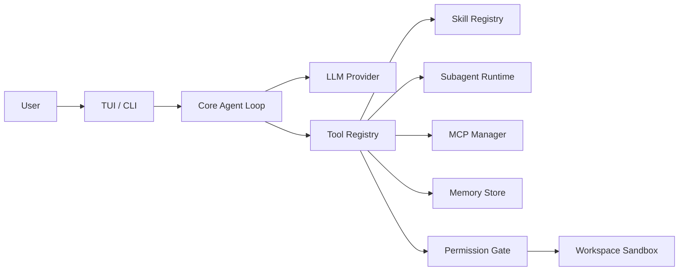
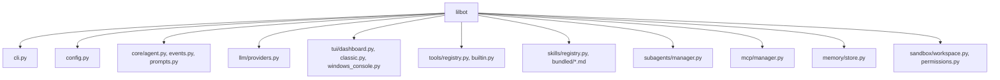

# LilBot Architecture Notes

These notes are clean-room observations from studying the local Claude Code source tree and CodeWhale. They describe architecture shapes and implementation targets for LilBot; they do not copy source code.

## What Matters

LilBot should not grow as one large script. The stronger pattern is a daemon-like core with thin clients around it:

## Claude Code Patterns To Emulate

- Agent definitions are metadata-rich, not just prompts: type, description, tool allowlist, disallowed tools, skill preload list, MCP server requirements, memory scope, max turns, background mode, and isolation mode.
- Subagents are task objects with lifecycle state. The parent agent can spawn work, resume existing work, summarize progress, and inspect task output.
- Skills are filesystem assets. A skill has frontmatter metadata, body text, source location, and security rules. Project/user/bundled/plugin sources should be layered with predictable precedence.
- MCP is a first-class service layer. Servers have config, env expansion, transport handling, auth/approval state, and tool/resource discovery.
- Memory is scoped. There is a difference between user memory, project memory, local machine memory, and agent-specific memory.
- Tool execution is surrounded by hooks, permissions, validation, result truncation, and UI rendering metadata.

## CodeWhale Patterns To Emulate

- The turn loop is a separate engine layer, not a UI concern.
- Tool setup, tool catalog, tool execution, approval, context capacity, and streaming are separate modules.
- TUI concerns are split: composer, paste, clipboard, footer, context inspector, tool cards, agent cards, streaming thinking, and routing.
- Context pressure is visible. The UI should show context usage and provide compaction/purge flows.
- Paste and clipboard are product features, not incidental terminal behavior.
- Long outputs should become handles/receipts that can be reopened instead of flooding the trace.

## Current LilBot Package Layout

## Next Build Targets

1. Agent definitions
   - Add `.lilbot/agents/*.md` and bundled agent definitions.
   - Fields: name, description, tools, disallowed_tools, skills, model, max_turns, memory_scope, background.
   - Use the metadata to constrain subagent tools and system prompts.

2. Skill system
   - Support directory skills: `skill-name/SKILL.md`.
   - Parse frontmatter with `name`, `description`, `paths`, `mode`, `tools`, and `risk`.
   - Add path-activated skills for code review, docs, git, data, research, and UI polish.

3. Tool runtime
   - Add structured tool events with output handles.
   - Add read-only shell validation and stronger destructive command warnings on Windows.
   - Add richer tools before relying on shell: git status/diff, diagnostics, web fetch, file search, todo, plan.

4. MCP
   - Expand beyond the current JSON-RPC-lines prototype.
   - Add list tools/resources/prompts.
   - Cache server status for the TUI and expose MCP health in Work.

5. Memory
   - Split memory into user, project, local, and agent memory.
   - Add `MEMORY.md` style markdown stores alongside JSONL indexes.
   - Add memory search scoring and context-budget trimming.

6. TUI
   - Keep mouse capture disabled for Windows paste/copy comfort.
   - Add trace search, selectable trace export, tool cards, subagent cards, and context inspector.
   - Make the thinking wave more informative: model phase, token estimate, active tool, elapsed time.

7. Core loop
   - Move compaction to a context manager.
   - Track per-turn state: queued, thinking, tool-running, waiting-permission, completed, failed.
   - Support background tasks and resumable task IDs.

